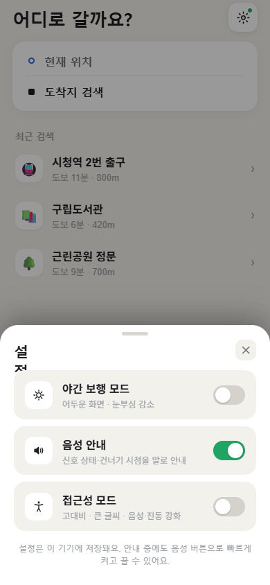
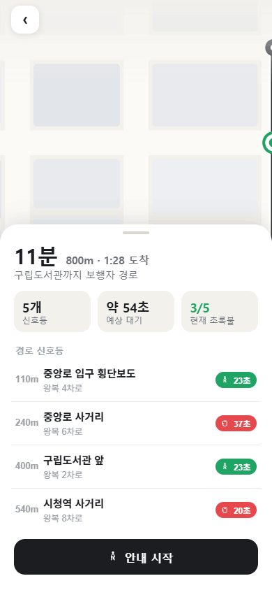
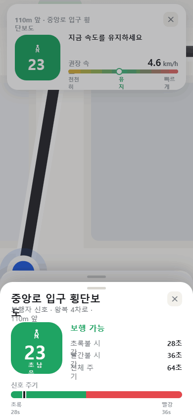
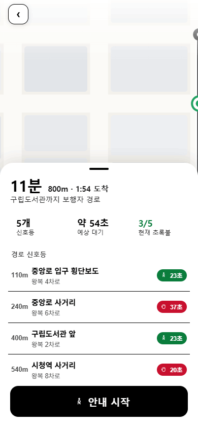

# KLP TrafficView — 신호등 길찾기 앱

> **팀 K.L.P** (이도윤, 박은규) 제출 프로젝트 — 보행자용 "신호등 인지형 길찾기" 모바일 웹앱
> 분석 정리: 2026-06-19

보행 경로 상의 **횡단보도 신호등 잔여시간**을 실시간으로 받아, **언제 건너고 어떤 속도로 걸어야 신호 대기 없이 도착하는지**를 안내하는 모바일 웹앱. 일반 지도앱이 "최단 거리"를 안내한다면, 이 앱은 **"신호를 가장 적게 기다리는 보행"** 을 안내하는 것이 핵심 차별점.

### ▶ [라이브 데모 열기](https://blackdew.github.io/klp-traffic-view/)

[](https://blackdew.github.io/klp-traffic-view/)

> 데모는 API 키 없이 **시뮬레이션 모드**로 동작합니다(상단 배지로 표시). 실데이터 연동 방법은 아래 [API 키 설정](#실행-방법) 참고.

---

## 한눈에 보기

| 항목 | 내용 |
|------|------|
| **유형** | 모바일 웹앱 (390×844 폰 뷰포트), 보행자 내비게이션 |
| **핵심 가치** | 횡단보도 신호 잔여시간 → "건널 타이밍 + 권장 보행속도" 안내 |
| **기술 스택** | React 18 UMD + Babel Standalone (빌드리스), 순수 SVG 지도, Web Speech API |
| **실데이터** | 공공데이터포털 `data.go.kr` KLID 신호제어기 신호잔여시간 API (서울) |
| **인프라** | Cloudflare Worker 프록시(CORS 우회), localStorage 설정 저장 |
| **상태** | `(완료)` 제출본 → [라이브 데모](https://blackdew.github.io/klp-traffic-view/) 배포 완료. 실연동 + 시뮬레이션 폴백 모두 동작 |
| **라이선스** | [MIT](LICENSE) |

---

## 화면

| 검색 | 경로 요약 | 권장속도 내비 | 접근성(고대비) |
|:---:|:---:|:---:|:---:|
|  |  |  |  |
| 도착지 검색·3중 테마 설정 | 신호 5개·예상 대기·현재 초록불 | 초록불 역산 권장속도 안내 | 고대비·큰 글씨·음성 강제 |

---

## 실행 방법

빌드 도구가 필요 없습니다. 용도에 따라 세 가지 방법:

1. **라이브 데모 (권장)**: [blackdew.github.io/klp-traffic-view](https://blackdew.github.io/klp-traffic-view/) — 설치 없이 바로 실행. 소스 버전을 GitHub Pages로 서빙해 로딩이 빠름.
2. **오프라인 단일 파일**: 루트의 [`신호등 길찾기 앱.html`](신호등%20길찾기%20앱.html)을 더블클릭 — 모든 코드·에셋이 인라인된 23MB 번들이라 **인터넷 없이도** 열림(첫 로딩 시 23MB 다운로드). 시연·배포 사본 전달용.
   > ⚠️ 이 번들은 **원본 제출 시점 스냅샷**이라 라이브 데모(소스 최신)와 다를 수 있습니다 — 이후의 데모 배지·모듈 분리 개선은 미반영. 최신 동작은 라이브 데모나 소스 버전을 사용하세요.
3. **로컬 소스 서버**: 개발용. `traffic_view/` 폴더를 로컬 서버로 서빙 (jsx를 `fetch`하므로 `file://` 직접 열기는 CORS로 실패).
   ```bash
   python3 -m http.server 8000   # 저장소 루트에서
   # http://localhost:8000/   (또는 traffic_view/traffic_view.html)
   ```

> 🔑 **API 키 설정**: 실시간 연동을 켜려면 [공공데이터포털 `data.go.kr`](https://www.data.go.kr)에서 KLID 신호제어기 신호잔여시간 API 활용신청 후 발급받은 **서비스키**를 `traffic_view/signal_api.jsx`의 `API_KEY`(현재 `"YOUR_SERVICE_KEY"` placeholder)에 넣으세요.
>
> ⚠️ **보안 주의**: 클라이언트(브라우저)에 키를 두면 노출되므로, 실서비스 전환 시 반드시 서버/프록시 측으로 옮겨야 합니다. (현재 Cloudflare Worker 프록시는 `apis.data.go.kr` 호스트만 허용해 오남용은 일부 차단)

---

## 파일 구조

```
klp-traffic-view/
├── index.html                 ← 라이브 데모 진입점 (GitHub Pages, 소스 버전 로드)
├── favicon.svg                ← 앱 아이콘 (3색 신호등)
├── LICENSE                    ← MIT
├── README.md                  ← 이 분석 문서
├── prd.md                     ← 데모 다듬기 작업 명세
├── 신호등 길찾기 앱.html        ← 오프라인 단일 파일 번들 (23MB, 원본 제출 스냅샷)
├── traffic_view.pdf           ← 제출 보고서 (157KB)
├── tests/data.test.js         ← 타이밍 로직 단위 테스트 (node tests/data.test.js)
└── traffic_view/              ← 소스 (모듈 분리)
    ├── traffic_view.html      ← (호환용) 루트 index.html 로 리다이렉트
    ├── data.jsx               ← 경로·신호 데이터 + 타이밍 알고리즘 (핵심 로직)
    ├── signal_api.jsx         ← data.go.kr 실시간 신호 API 연동 레이어
    ├── icons.jsx              ← 순수 SVG 아이콘 컴포넌트 (app.jsx 에서 분리)
    ├── map.jsx                ← SVG 절차적 도시 지도 + 경로·신호·보행자 렌더
    ├── app.jsx                ← 화면 4종 + 앱 셸 + 마스터 시계 + 음성엔진
    ├── proxy/cloudflare-worker.js  ← CORS 우회 프록시 (배포 가이드 주석 포함)
    ├── screenshots/           ← 개발 단계 스크린샷 (a11y·dark·nav·live 등)
    └── uploads/               ← 개발 참고 자료 (API 응답 샘플 api.txt + 참고 이미지, 앱 비사용)
```

---

## 아키텍처 / 동작 원리

### 1. 빌드리스 React 구조
`traffic_view.html`이 CDN에서 React 18 + ReactDOM + Babel Standalone을 불러오고, 4개의 `.jsx`를 `type="text/babel"`로 브라우저에서 즉석 트랜스파일. 각 모듈은 `window`에 심볼을 노출하는 방식으로 의존성을 공유(번들러 없는 전역 네임스페이스 패턴).

### 2. 신호 타이밍 알고리즘 — `data.jsx` (이 프로젝트의 두뇌)
- **경로 모델**: 출발→신호 5개→도착을 누적거리(`d`, 미터)와 SVG 좌표를 가진 `NODES`로 표현. 총 800m.
- **신호 모델**: 각 횡단보도는 `green`/`red` 주기와 `offset`(위상차)으로 정의. `signalPhase(sig, t)`가 임의 시각 `t`의 색·잔여시간을 계산.
- **`greenWindows()`**: 앞으로 `horizon`초 내 들어올 **초록불 구간 목록**을 산출.
- **`recommendSpeed(거리, 신호, now)`** ← 핵심 기여: 각 초록 구간에 대해 *편안한 보행속도(1.25 m/s)에 가장 가깝게* 도착시키는 속도를 역산하고, 도달 가능한 구간 중 기준속도와의 편차가 최소인 것을 선택. 결과로 `유지 / 조금 빠르게 / 천천히` 힌트와 km/h 권장속도를 반환. 어떤 초록불도 편하게 못 맞추면 "다음 신호 대기" 안내로 폴백.

### 3. 실시간 연동 — `signal_api.jsx` + 프록시
- 엔드포인트: `apis.data.go.kr/B551982/rti/tl_drct_info` (신호제어기 신호잔여시간).
- 응답 1행 = 교차로 1개. 방향(nt/et/st/wt…) × 종류(보행 `Pdsg`/직진/좌회전…) 매트릭스. **보행신호(`Pdsg`)만** 추출, `RmndCs`는 1/10초 단위(36000↑은 "미정" 센티넬).
- 지역 필터는 클라이언트에서 `stdgCd` 접두 `11`(서울)로 수행(서버 필터가 무시되는 API 특성 대응). 경로의 신호 5개에 실제 교차로를 수동 매핑하거나 자동 배정.
- 브라우저 CORS 차단 → **Cloudflare Worker 프록시**가 `apis.data.go.kr`만 화이트리스트로 중계.
- 5초 주기 폴링. 실패 시 자동으로 **시뮬레이션 모드**로 폴백(주기 기반 가상 신호) → 데이터 없어도 앱은 항상 동작. 상단 배지로 `서울 실시간 신호 연동 / 연결 중 / 시뮬레이션 모드 · 데모` 상태 표시.

### 4. 화면 흐름 — `app.jsx`
`search → summary → nav → done` 4단계 상태머신.
- **마스터 시계**: `requestAnimationFrame` 루프가 `simNow`를 진행시키고, nav 화면에서는 권장속도로 보행자를 전진시키되 빨간불 앞에서 멈춤(현실적 시뮬레이션). 1×/2×/4× 배속.
- **Summary**: 총 소요·예상 대기·현재 초록불 개수 통계 + 신호 목록.
- **Nav**: 다음 신호 대형 카운트다운 + 권장속도 게이지 + 진행바 + 다가오는 신호 리스트.
- **음성 안내**: Web Speech API(`ko-KR`)로 "초록불입니다, 지금 건너세요" 등 상황별 발화 + `navigator.vibrate` 햅틱. 중복 발화 방지 키 적용.

### 5. 접근성(a11y) — 돋보이는 부분
- 3중 테마: **라이트 / 야간(dark) / 접근성 고대비**. a11y는 순수 흑백 + 진한 신호색 + 폰트 1.16배 + 2px 테두리.
- 접근성 모드에서는 **음성 안내 강제 ON**(시각약자 배려). 큰 글씨·큰 터치 타일.
- 이는 "보행 약자(고령자·시각장애)"라는 타깃 사용자를 명확히 의식한 설계로, 신호등 길찾기 주제와 잘 맞물림.

---

## 평가 관점 메모 (멘토링/심사용)

**강점**
- 문제 정의가 선명하고 차별적: "최단"이 아니라 "신호 대기 최소" 보행 — 권장속도 역산 알고리즘으로 구체화.
- 실데이터 연동을 끝까지 해냄(공공 API + CORS 프록시 + 폴백 설계). 실패해도 죽지 않는 graceful degradation.
- 접근성을 부가기능이 아닌 1급 요구사항으로 설계.
- 빌드 도구 없이도 모듈을 깔끔히 분리(데이터/연동/지도/앱).

**보완/질문거리**
- API 키 클라이언트 하드코딩 → 실서비스 보안 이슈(위 주의 참고).
- 경로·지도가 **하드코딩된 가상 도시**(800m 고정). 실제 지오코딩·경로탐색(도착지 검색 → 좌표 → 신호 매핑)은 미구현 — "검색"은 데모용 최근목록. 확장 시 가장 큰 과제.
- 권장속도가 사용자에게 실제로 따라 하기 쉬운지(UX 검증), 신호 위상차 데이터의 실측 정확도.
- 단위 테스트 없음(타이밍 로직은 순수함수라 테스트하기 좋은 구조 → 보완 권장).

---

## 출처
- 원본: `(완료) K.L.P(이도윤, 박은규)-20260619T014034Z-3-001.zip` (Downloads, 2026-06-19 수신)
- API: 공공데이터포털 KLID 신호제어기 신호잔여시간(`B551982/rti/tl_drct_info`), 응답 샘플 `traffic_view/uploads/api.txt`
